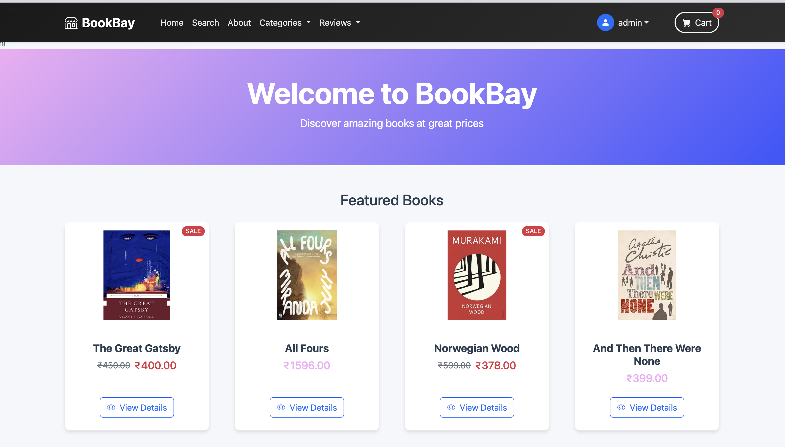
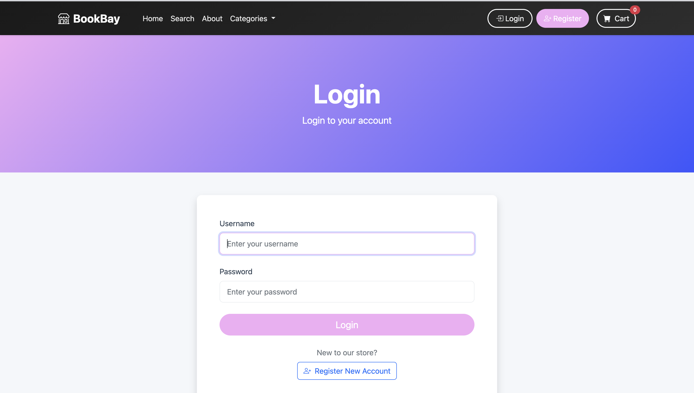
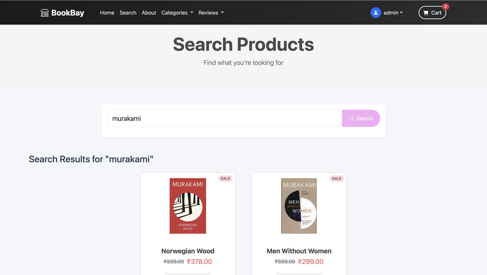
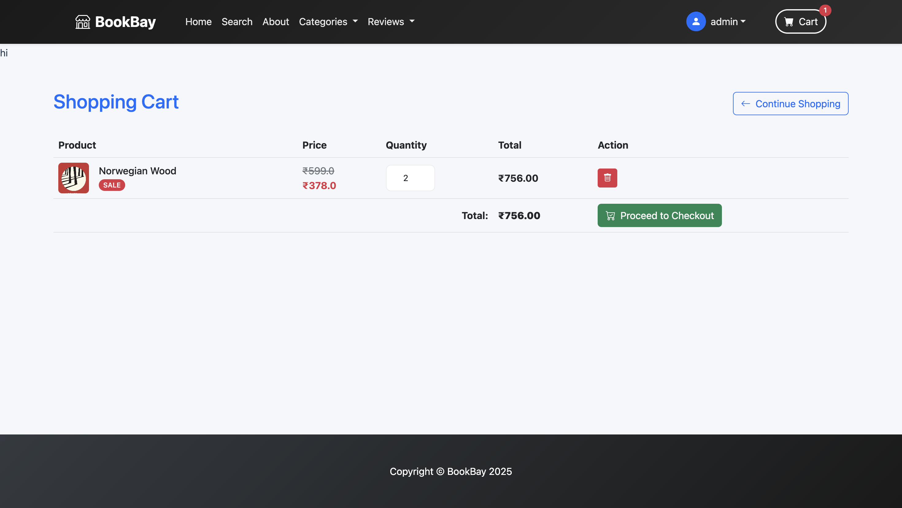
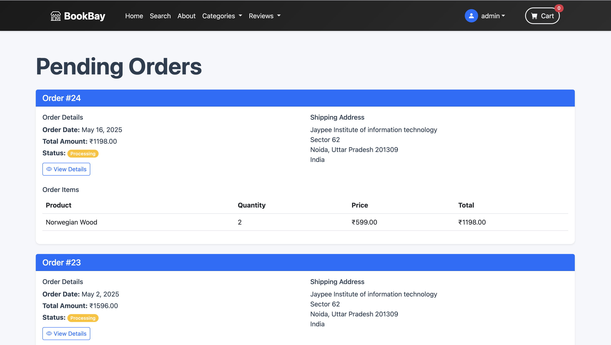
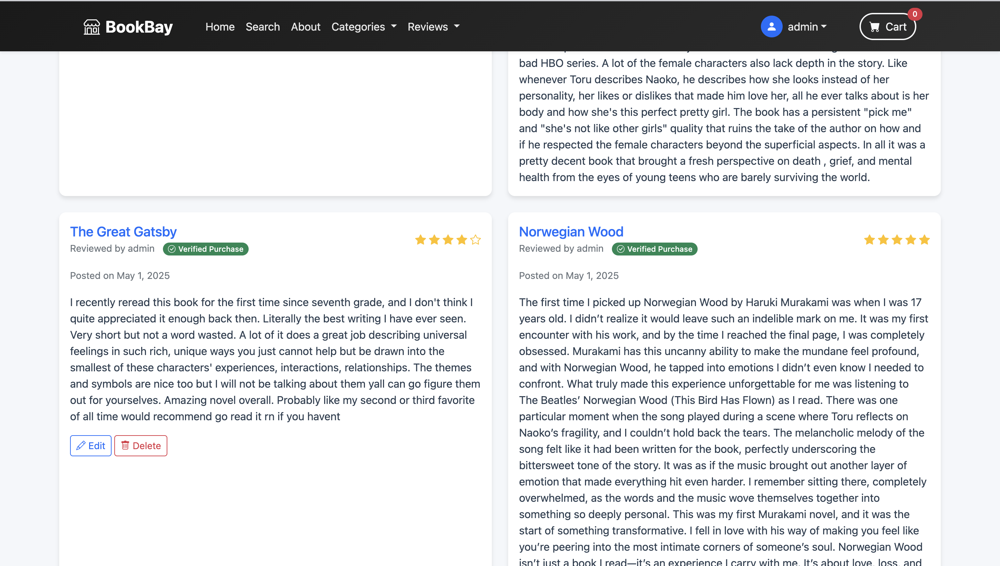

# BookBay

BookBay is a ecommerce platform built with Django, designed for online book selling with recommendation capabilities.



## Features

- **User Authentication**: Secure login, registration, and profile management
  
- **Product Catalog**: Browse and search books
  
- **Shopping Cart**: Add, update, and remove items from your cart
  
- **Order Management**: Track and manage orders
  
- **Recommendation System**: ML-powered book recommendations based on user behavior
- **Review System**: Add reviews and ratings for books
  
- **Payment Processing**: Secure payment processing
- **User Profile**: Manage your profile and order history 

## Technology Stack

- **Backend**: Django 4.2+
- **Database**: SQLite (development), PostgreSQL (production-ready)
- **Frontend**: HTML, CSS, JavaScript
- **Image Processing**: Pillow
- **Machine Learning**: NumPy, scikit-learn for recommendation engine
- **Environment Variables**: python-dotenv

## Installation

1. Clone the repository
   ```
   git clone https://github.com/nehapal22/BookCommerce.git
   cd BookCommerce
   ```

2. Create and activate a virtual environment
   ```
   python -m venv venv
   source venv/bin/activate  # On Windows: venv\Scripts\activate
   ```

3. Install dependencies
   ```
   pip install -r requirements.txt
   ```

4. Set up environment variables
   Create a `.env` file in the project root with the following variables:
   ```
   DEBUG=True
   SECRET_KEY=your_secret_key
   DATABASE_URL=your_database_url  # Optional for PostgreSQL
   ```

5. Run migrations
   ```
   python manage.py migrate
   ```

6. Create a superuser
   ```
   python manage.py createsuperuser
   ```

7. Start the development server
   ```
   python manage.py runserver
   ```

8. Access the application at `http://127.0.0.1:8000`

## Project Structure

- **store**: Core app handling products, categories, and user accounts
- **cart**: Shopping cart functionality
- **payment**: Order processing and payment handling
- **recommender**: ML-based book recommendation system
- **media**: Stores uploaded product images
- **static**: CSS, JavaScript, and static assets

## Usage

1. Access the admin panel at `/admin` to manage products, orders, and users
2. Browse the product catalog on the homepage
   
3. Add items to your cart and proceed to checkout
   
4. Complete the payment process
5. View your order history in your profile
   

## Development

### Running Tests
```
python manage.py test
```

### Creating New Apps
```
python manage.py startapp app_name
```

## Contributors

- Neha Pal (@nehapal22)

## Acknowledgments

- Django community for the excellent web framework
- scikit-learn for machine learning capabilities
